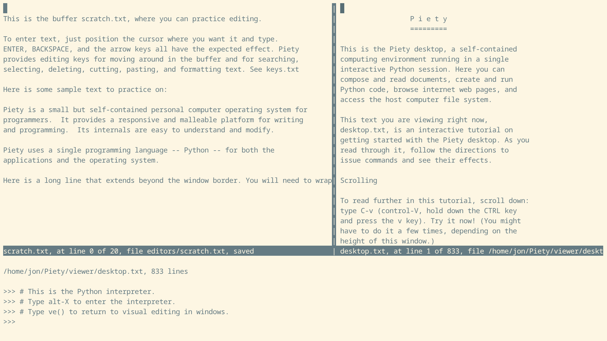

Piety
=====

**Piety** is an operating system written in Python.

[Motivation and Goals](#Motivation-and-Goals)  
[Current Status](#Current-Status)  
[Quick Start](#Quick-Start)  
[Demos](#Demos)  
[Screenshots](#Screenshots)   
[Roadmap](#Roadmap)  
[Tested Platforms](#Tested-Platforms)  
[Footnotes](#Footnotes)  

## Motivation and Goals ##

Piety is a small but self-contained personal computer operating system for
programmers.  It provides a responsive and malleable platform for writing
and programming.  Its internals are easy to understand and modify.
 
Piety uses a single programming language -- Python -- for both the
applications and the operating system. You can use the language interpreter
to inspect and manipulate any data in the running system.  Changes to
application and system code are effective immediately, without having to
stop and restart the system.

Piety is a reaction against the complexity and disempowerment of today's
dominant computer systems.  I take inspiration from the single user, single
language, special hardware systems of the 1970s and 80s: Smalltalk, Lisp
machines, Oberon (see [doc/precursors.md](doc/precursors.md)).     Piety is
an experiment to see if I can put together something similar today, but
using a familiar programming language running on ordinary hardware.  Let's
see how far we can get with just Python. There is already a lot of work by
others that we might be able to adapt or use as models (see
[doc/utilities.md](doc/utilities.md)). For other projects in a similar
spirit, again see [doc/precursors.md](doc/precursors.md).
  
## Current Status ##

For now, Piety runs in an ordinary Python interpreter session in a single
terminal on a host operating system.   The Python interpreter with its runtime
is the virtual machine where the Piety OS now runs, analogous to the QEMU
virtual machine in many other operating system projects.

Piety provides a [display editor](editors/README.md), a [customized
Python interpreter](tasking/pyshell.py) that also acts as the system
[shell](console/README.md), a [customized debugger](editors/breakpt.md),
and its own [web browser](browser/README.md). These, and other Python
applications, can all be presented together in a
[desktop](viewer/README.md) controlled by a custom window manager in a
single full-screen terminal.

The display editor can support multiple buffers and windows in the
terminal, and also a region for the Python interpreter. The debugger can
work in the interpreter region without disturbing window contents.
Together these provide a minimal but self-contained programming
environment within a single Python terminal session.

Piety development is self-hosted in this programming environment.  Code is
added and revised in a long-running Python session.  Code  is imported and
reloaded into the session without restarting or  losing work in progress.
To make this possible we adopted a
[particular workflow and coding style](editors/HOW.md).

Piety provides concurrency with a Python *asyncio* event loop.  Tasks 
are implemented by Python *coroutines* or *readers* (event handlers) that
run in an event loop.

Piety provides *asyncio* readers for its custom Python shell and its
editor.  These enable the shell and the editor to run without 
blocking in an event loop, so other tasks can run concurrently, as you 
type commands in the shell or edit text in the editor.  

The editor is not just for creating text. Python commands including
concurrent tasks can redirect their output to editor buffers and windows, so
the editor can be used for data capture and animated display.  We
use it for [experiments](piety) in tasking and concurrency
where tasks update windows as we control their behavior by typing  commands
at the Python interpreter.

We also use the editor as our [web browser](browser/README.md).
Downloaded web pages are stored and displayed in editor buffers.

Here is more about some Piety [design decisions](doc/rationale.md) and their
rationales.

The present version of Piety was started from scratch in February 2023.  Its
development is ongoing here in the *rewrite* branch of the *Piety* repository.
An archive of the earlier version of Piety that was abandoned in January 2023
is here in the  *master* branch and *version1* tag.  The *rewrite* branch
is now the main branch; I will  never merge it back into *master*.

## Quick Start ##

There isn't any installation procedure. There are no
dependencies. Just clone the Piety repository under
your home directory:

    git clone  https://github.com/jon-jacky/Piety.git

Run this command to put the Piety modules on your
*PYTHONPATH*, so you can run them from any directory.
Note the dot at the beginning of the command:

    . ~/Piety/bin/paths      

The Piety desktop can run in a terminal window
expanded to full screen in a graphical desktop, or in
a full screen text-only console.

Select a font size that can display at least 135
columns across the full width of the display.

Run this command to start the desktop:

    python3 -im desktop

The desktop appears, with the windows showing
the buffers named in a startup file.

If this is your first time using Piety, it will
be helpful to read and work through the interactive
tutorial displayed in the window on the right.
 
## Demos ##

Some interactive demonstrations are described in 
[pmacs_script.md](piety/pmacs_script.md) and 
[edsel_script.txt](piety/edsel_script.txt) and
[pmacs_blocking.md](piety/pmacs_blocking.md) and 
[audoindent.md](editors/autoindent.md) and
[breakpt.md](editors/breakpt.md).
These pages give instructions so you can do the demos yourself.

A few of the demos are not very interactive, so can be run from scripts:
[pmacs_script.py](piety/pmacs_script.py) and
[edsel_script.py](piety/edsel_script.py).

At this time, the demos do not run in the Piety desktop.   Each demo runs
in its own Python session, as described in its instructions.

## Screenshots ##

The pages about the Piety [desktop](viewer/README.md), 
[browser](browser/README.md), and 
the event loop demos [here](piety/pmacs_script.md) 
and [here](piety/vedsel_script.md) include screenshots. 
This [directory](screenshots) contains a few more.
          
## Roadmap ##

I hope someday to run Piety on a bare machine with no other
operating system, but only a Python interpreter with minimal support.

Piety divides naturally into two independent parts: the *hosted* part and
the *native* part.  The hosted part can run in any Python interpreter. It
includes the editors, shells, tasking, the  programming environment,
and any tools and applications we might write.  The native part includes the
Python interpreter itself, and the support needed to run the interpreter  on
the computer hardware.   Almost any general-purpose operating system can
serve as the support, but the goal is to replace that with a special-purpose
operating system which is itself mostly written in Python.

All the work I have done so far, including the programming environment, is
in the hosted part.  I have researched 
[several approaches](doc/baremachine.md) to building the native part.
I hope to begin soon.

The obvious first step is to configure a minimal Linux running
Python as its process 1. This would provide a system that boots into a
Python prompt and provides a Python-only system to the user and
application programmer. This is all we need to perform the essential
experiment to see if it is feasible to continue Piety development and
other personal computing activities using only Python running Piety in
the console, without depending on a host OS to provide a desktop with
multiple windows, the system shell, and other utilities.
  
## Tested Platforms ##

The Piety software has run on a MacBook Pro running Mac OS,
a Lenovo Chromebook running Linux, and an HP laptop running Linux.
Details in [platforms.md](doc/platforms.md).

### Footnotes ###

The phrase "complexity and disempowerment" is from a posting by
[jl6](https://news.ycombinator.com/item?id=24917101)

Revised May 2026

