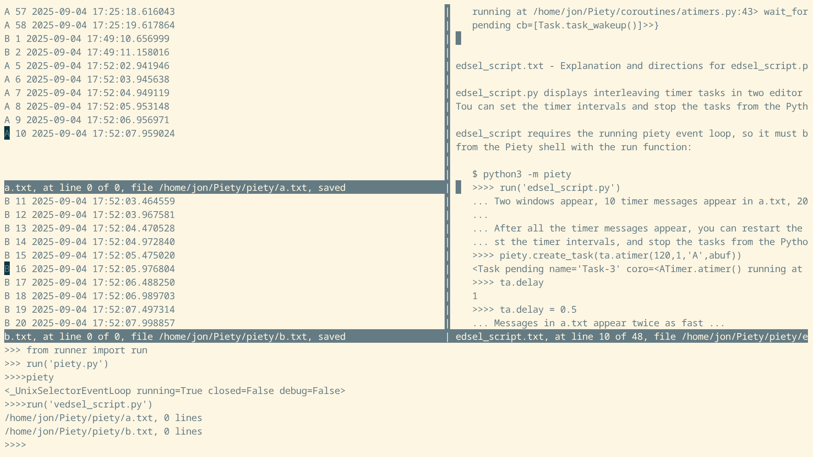

piety
=====

The *piety.py* script here starts a Piety desktop session where you can 
start tasks that run concurrently as you edit in windows or run commands
at the Python REPL.

Piety provides concurrency with a Python *asyncio* event loop.  Our event
loop object is also named *piety*. Tasks are implemented by Python
*coroutines* and *readers* (event handlers) that run in this event loop.

Piety provides readers for *pysh*, its custom Python shell, and *pmacs*, its
display editor.  These enable the shell and the editor to run without 
blocking in the event loop, so other tasks can run concurrently, as you 
type commands in the shell or edit text in the editor.  You can control
other tasks from the shell and display task output in editor windows.

More to come ...

### Files ###

- **aiotimers.py**:  Demonstrations of *asyncio* tasking, that run in the
    Piety desktop.

- **aiotimers.md**:  Directions and explanations of the demonstrations in
    *aiotimers.py*

- **apmacs.py**: Adapt the *pmacs* editor to run in an *asyncio* event loop.  

- **apyshell.py**: Adapt the *pysh* custom Python shell to run in an *asyncio*
  event loop.
 
- **eventloop.py**: Creates the Piety *asyncio* event loop, named *piety*.
    Defines the function *startpiety* that starts the event loop and 
    also *tasks* to list tasks running in the event loop.

- **piety.py**: Script that starts a Piety desktop session that includes
    the *piety* event loop.
   
- **piety_startup.py**: Called by *piety.py*, loads some buffers into 
    the desktop session.

Modules and documentation files for older demos that do not run in the
Piety desktop are described in [piety0.md](piety0.md).
    
Revised Jul 2026
 
