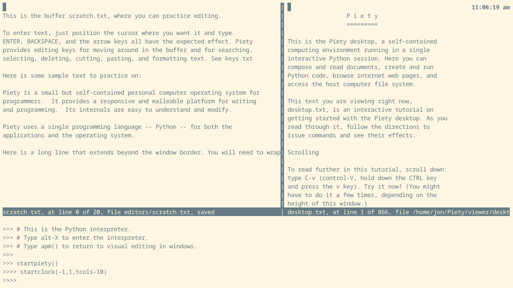

piety
=====

Piety provides concurrency with a Python *asyncio* event loop. Tasks are
implemented by Python *coroutines* and *readers* (event handlers) that
run in this event loop.

Piety provides *asyncio* readers for its custom Python shell and its
editor.  These enable the shell and the editor to run without 
blocking in an event loop, so other tasks can run concurrently, as you 
type commands in the shell or edit text in the editor.  

[Starting the Event Loop](#Starting-the-Event-Loop)   
[Clock Task](#Clock-Task)   
[Stopping the Event Loop](#Stopping-the-Event-Loop)   
[Demos](#Demos)   

### Starting the Event Loop ###
  
The *piety.py* script here starts a Piety desktop session where you can 
start tasks that run concurrently as you edit in windows or run commands
at the Python REPL.

From your *Piety* directory, start the *piety* script from the system
command interpreter:

    python3 -im piety
    
The Piety desktop appears.   When the desktop starts up, the 
event loop is not running, so you can't run tasks.  

To start the event loop, type the *startpiety* command at the Python
prompt in the REPL:

    >>> startpiety()
    >>>>
    
Now the prompt in the Python REPL has expanded from three darts *>>>* to
four *>>>>* to show the event loop is running (pictured below).

The name of the event loop is *piety*:        

    >>>> piety
    <_UnixSelectorEventLoop running=True closed=False debug=False>    
 
To return to display editing from the *>>>>* prompt -- while the event loop
is running ---  type the command
*ade()* (not  *de()*, which you use from the *>>>* prompt when the event
loop is not running). 

The command *apm()* also returns the cursor to the window. Some older
Piety documentation uses *apm()* not *ade()*. The commands *ave()*
*aved()* and *aee()* also work.

### Clock Task ###
    
When the event loop is running, you can start tasks. Start the on-screen 
clock:

    >>>> startclock(-1, 1, tcols-10)

The clock appears in the upper right corner of the terminal and updates
every second (pictured above)
    
The first argument -1 tells the clock to run until you stop it.  The second
argument tells the clock to update every second.  The third argument
is the column number in the top line of the terminal where the clock appears
(*tcols* is the width of the terminal -- allow 10 characters for the clock).

The running clock is a Python *asyncio* task:

    >>>> tasks()
    {<Task pending name='Task-1' coro=<AClock.aclock() running at
    /home/jon/Piety/piety/aclock.py:35> wait_for=<Future pending
    cb=[Task.task_wakeup()]>>}

The *stopclock* command stops the clock:

    >>>> stopclock()
    
The clock stops ticking.  Its task has exited:

    >>>> tasks()
    set()
    
To remove the clock from the display, refresh the viewer window by
typing the command *vvrefresh()*, or, while display editing, typing the
*M-m* key.

You can resume the clock by typing the *startclock* command, with its 
arguments, again.

### Stopping the Event Loop ###

To stop the event loop, type *C-d* at the *>>>>* prompt in the Python REPL.
The *>>>* prompt appears.  If the clock is displayed, it stops ticking.
Remove it from the display by refreshing the viewer window.

Now you must use *de()* again, not *ade()*, to return to display editing.
 
### Demos ###

The [aiotimers](aiotimers.md) module contains experiments, or demos,
where tasks update windows as we control their behavior by typing
commands at the Python interpreter.

### Files ###

- **aclock.py**: Clock that runs in the Piety desktop, as an asynico task.

- **aiotimers.py**:  Demonstrations of *asyncio* tasking, that run in the
    Piety desktop.

- **aiotimers.md**:  Directions and explanations of the demonstrations in
    *aiotimers.py*

- **apmacs.py**: Adapt the *pmacs* editor to run in an *asyncio* event loop.  

- **apyshell.py**: Adapt the *pysh* custom Python shell to run in an *asyncio*
  event loop.
 
- **eventloop.py**: Creates the Piety *asyncio* event loop, named *piety*.
    Defines the function *startpiety* that starts the event loop and 
    also *tasks* to list tasks running in the event loop.

- **piety.py**: Script that starts a Piety desktop session that includes
    the *piety* event loop.
   
- **piety_startup.py**: Called by *piety.py*, loads some buffers into 
    the desktop session.

Modules and documentation files for older demos that do not run in the
Piety desktop are described in [piety0.md](piety0.md).
    
Revised Jul 2026
 
