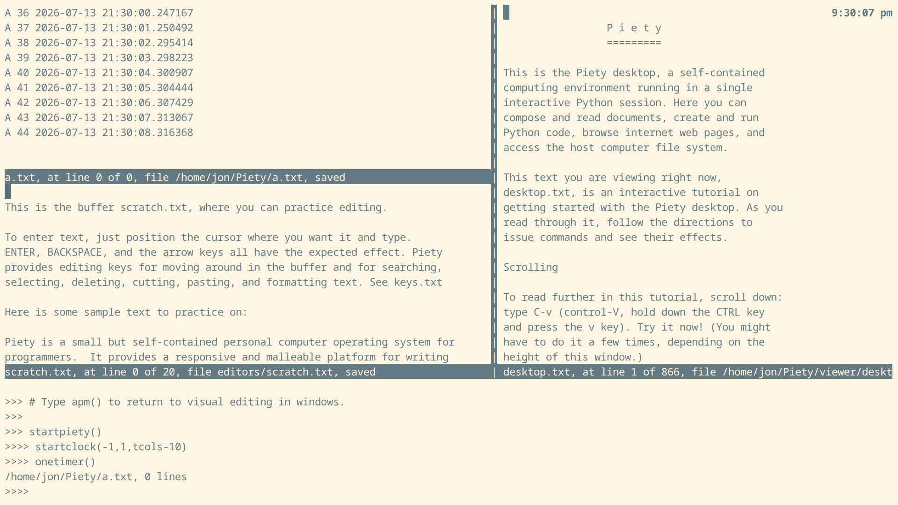

aiotimers
=========

The *aiotimers* module contains experiments, or demos,
where tasks update windows as we control their behavior by typing
commands at the Python interpreter.   The *aiotimers* module is imported by
the *piety* startup script, so it is already available in the desktop.

Each demo is started by a command (a function): *onetimer*, *twotimers*,
*starttimer*.

[ontimer](*onetimer)   
[twotimers](*twotimers)
[starttimer](*starttimer)
[stoptimer](*stoptimer)
 
### onetimer ###

The *onetimer* demo shows our Python shell and our display editor
running without blocking in a Python *asyncio* event loop, while a timer
task runs concurrently, as you type commands in the shell or edit text
in the editor. Timer messages appears in an editor window, and you can
control the speed of the timer from the shell -- or stop it and create
another one.

Before you can run the demo, you must start the Piety desktop
with *python3 -im piety*, then start the event loop by typing the
command *startpiety()* at the Python prompt, as explained on the 
[piety](piety.md) page.  You may also start the clock with *startclock()*.

Now you can start the demo.  Type this command in the  Python REPL:

    >>>> onetimer()
    
A window for the *a.txt* buffer appears and begins filling with timer messages,
one per second.  If you started the clock, it will continue to tick once
per second also. 

The timer task will type 1000 messages, then exit. At one second per
message, this takes about 17 minutes.

The *onetimer* command put the cursor into the other editing window.
Type some text into the window and confirm that the timer
messages continue appearing, without interfering with your typing.

Type *M-x* to put the cursor in the Python REPL.  You can type commands
while the timer messages appear.

Type the command to show some information about the timer task. If you
started the clock, that will be shown too:

    >>> tasks()
    {<Task pending name='Task-2' coro=<ATimer.atimer() running at
    /home/jon/Piety/coroutines/atimers.py:43> wait_for=<Future pending
    cb=[Task.task_wakeup()]>>,
    <Task pending name='Task-1' coro=<AClock.aclock() running at
    /home/jon/Piety/piety/aclock.py:35> wait_for=<Future pending
    cb=[Task.task_wakeup()]>>}

You can have several timer tasks.  *timer* is a dictionary of timer objects
indexed by buffer name.  The most interesting attributes of a timer object
are its *delay*, the interval between messages, and *exit*, which you can
assign *True* to cause the timer task to exit.

    >>>> timer
    {'a': <atimers.ATimer object at 0x7fa1379890>}
    >>>> timer['a'].delay
    1
    >>>> timer['a'].exit
    False

It is conventient to make an abbreviation for the timer name:

    >>>> ta = timer['a']
    
Set the delay to 0.1 to print messages ten times a second.

    >>>> ta.delay = 0.1

Soon all 1000 messages appear and the timer task exits.  Or, you can
stop the timer yourself:

    >>>> ta.exit = True

### twotimers ###

The *twotimers* demo is similar to *onetimer*, but it runs timers in 
both editor windows at different speeds:

    >>> twotimers()
    >>>> timer
    {'a': <atimers.ATimer object at 0x7fa137a010>, 
    'b': <atimers.ATimer object at 0x7fa1379e90>}
    >>>> timer['a'].delay
    1
    >>>> timer['b'].delay
    0.5
 
### starttimer ###

The *starttimer* command starts a timer running in an existing window.
The first argument is the basename of the buffer to write the messages in.
The next two arguments are the number of messsages to print before
exiting, and the delay between messages:

Move the cursor to the *a.txt* window created by *onetimer* or
*twotimers* and type this command:

    >>>> starttimer('a',1000,1)

The buffer basename here is *'a'* so it doesn't create a new buffer,
it uses the existing *a.txt* buffer.
    
You can experiment with running the timer faster, to see how fast
it can go and still not interfere with editing or typing commands:

    >>>> starttimer('a',1000000,0.01)
    >>>> # 100 messages/sec, Can I still type?
    >>>> ta = timer['a']
    >>>> ta.delay = .001    
    >>>> # 1000 messages/sec, Can I still type?    
    >>>> ta.exit = True
    
### stoptimer ###

The *stoptimer()* command, with no arguments, stops the timer in the 
current window, so you don't have to assign *timer['a'].exit*.    

Revised Jul 2026
 
