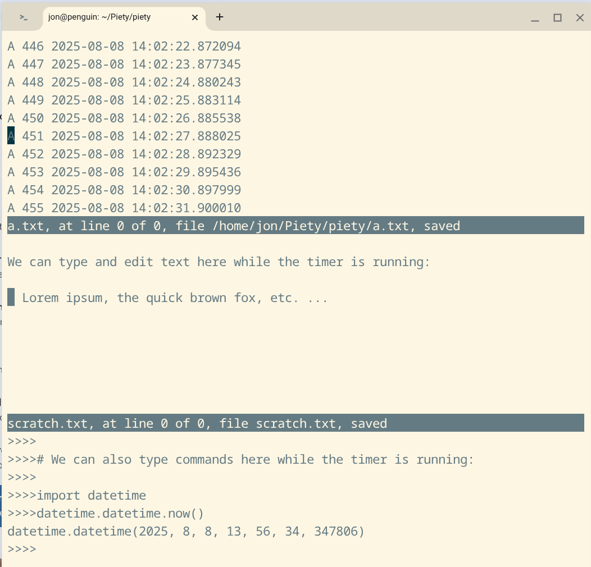

piety0
======

The *piety* directory contains some older Python modules and
documentation to demonstrate asyncio tasking that do not use the Piety
desktop, but run in pared-down Piety sessions without the viewer window.

These demos use the old *piety0* module, not the newer *eventloop*
module which supercedes it in the Piety desktop.

The *piety0* module creates an event loop named *piety*, adds the
readers for the shell and the editor, and starts the event loop with the
shell running. It also imports a function *run* which is needed to run
other scripts in the event loop.

This directory contains several demos. *pmacs_script.py* is one of the
most recent and shows the most features.

>

These demo scripts cannot run standalone. First you must run the *piety0*
script to start a Piety session, then run the demo script within the session
using the *run* function. See the *.md* and *.txt* files for directions
on how to run each demo.

(There are also some modules here that do run in the desktop, but have
been superceded by the newer [aiotimers](aiotimers.md) module.)

### Files ###

These are the modules and documentation files for these demos.  Other
files in this directory, including some imported by these modules, 
are described in [README.md](README.md).

- **atimer_script.py**: Demonstrate the Python shell and timer tasks interleaving
  in the Piety event loop.

- **atimer_script.txt**: Explanation and directions for *atimer_script.py*.
 
- **edsel_script.py**: Display interleaving timer tasks in two editor windows.
  Set the timer intervals and stop the tasks from the Python REPL.

- **edsel_script.txt**: Explanation and directions for *edsel_script.py*.
    not start it.

- **piety0.md**: This file, about some files in the *Piety/piety* directory.
    
- **piety0.py**: Begin a Piety session by starting the *asyncio* event loop.
  Import a function *run* which is needed to run other scripts in the event loop.
  
- **piety0.txt**: Explanation and directions for using *piety0.py*.

- **pmacs_blocking.md**: Explanation and directions for demonstrating
  cooperative multitasking and blocking using *pmacs_script.py*.

- **pmacs_script.md**: Explanation and directions for *pmacs_script.py*.
  Includes a screenshot.

- **pmacs_script.py**: Edit in one window while a timer task updates the other.
  Set the timer interval, and stop and start timer  tasks from the
  Python REPL.

- **vedsel_script.md**: Explanation of *vedsel_script.py*.
    Includes a screenshot.
  
- **vedsel_script.py**: Similar to *edsel_script.py*, but in the Piety
    desktop with the viewer window.  See instructions in comment header.

- **vpmacs_script.py**: Similar to *pmacs_script.py*, but in the Piety
    desktop with the viewer window.  See instructions in comment header.

- **v2pmacs_script.py**: Similar to *vpmacs_script.py*, but uses 
    *eventloop.py* not *piety.py*. See instructions in comment header.
         
Revised Jun 2026

 
