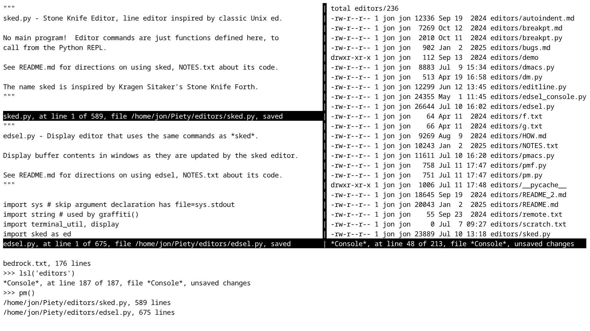
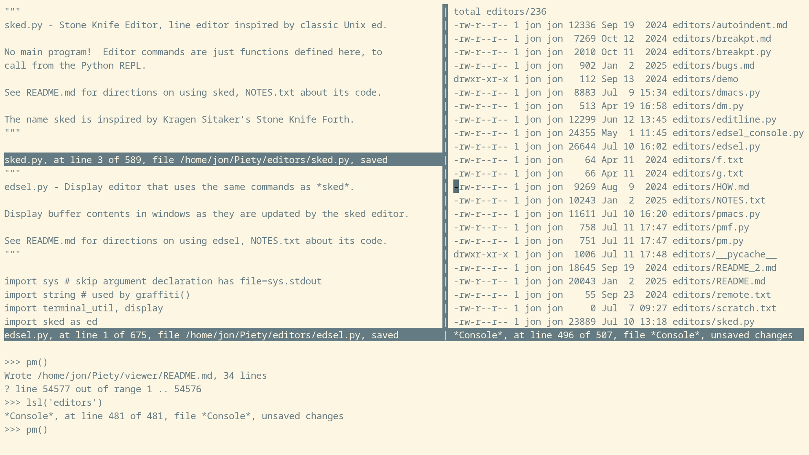

Piety desktop
=============

Piety can provide a 'desktop' with a Python console, an
editor. a web browser, a terminal, and other Python
applications, all controlled by a custom window
manager in a single full-screen terminal.

<!-- 

Use HTML (below) instead of this markdown to adjust size.
width=50% [Aworks but width="960" does *not* work.
-->

[Quick Start](#Quick-Start)  
[Appearance](#Appearance)   
[Workflow](#Workflow)  
[Commands](#Commands)   
[Keycodes](#Keycodes)   
[Influences](#Influences)

### Quick Start ###

There isn't any installation procedure. There are no
dependencies. Just clone the Piety repository under
your home directory.

Run this command to put the Piety modules on your
*PYTHONPATH*, so you can run them from any directory.
Note the dot at the beginning of the command:

    . ~/Piety/bin/paths      

The Piety desktop can run in a terminal window
expanded to full screen in a graphical desktop, or in
a full screen text-only console.

Select a font size that can display at least 135
columns across the full width of the display.

Run this command to start the desktop:

    python3 -im vpm

The desktop appears, with the buffer list in the viewer window
and the *scratch.txt* buffer in the editor window.  The cursor
is at the Python prompt in the REPL region at the bottom.
Now you can run the desktop by typing [commands](#Commands) at the
Python prompt.   Type the *pm()* command to enter display
editing, where you can run the desktop by typing [keycodes](#Keycodes).

### Appearance ###

The Piety desktop contains an 80 column wide *editor
panel* on the left and a *viewer panel* that occupies
the remaining columns on the right, usually fewer than
80 if a comfortably large enough font size is chosen.
The editor panel can contain one or two windows. The
viewer panel can only contain one window. 

Below both panels is the *REPL region*. that extends the
full width of the display.
 
### Workflow ###

The interactive Python interpreter runs in the REPL
region. Here you can type any Python statement. Some
statements are commands to start a Piety activity in a
window. (Piety has *activities* instead of
applications, as explained
[here](../editors/HOW.md).)

At all times, one window is the *focus window* which
displays a cursor where typed input appears. The
activity running in the focus window detects and
executes typed keycodes. Some commands typed in the
REPL start an activity in the focus window, or display
some output in the focus window. There are many
commands that select or change the focus window,
sometimes as a side-effect of something else, for
example listing a directory of files.
 
(When the REPL is selected, the cursor moves from the
focus window to the REPL region, and typed input
appears there. Meanwhile, the same window retains the
focus, and when the REPL operation is complete, the
cursor returns there.)
 
Any activity can run in any window, including editors.
You can edit in the viewer panel window just as you
can in the editor panel windows, except that window is
narrower.

Although the viewer window can support any activity,
it is intended to display information that informs or
supports activities in the editor windows: directory
listings, lists of editor buffers, shell commands and
their output, instructions and documentation
(including this very file -- note its short line
length). 

Some commands make special use of the viewer window,
to help make the workflow convenient. For example,
some commands, given while an editor window has
focus, display information in the viewer window --
such as a list of buffers or files -- without losing
focus from the editor window. Some commands given in
the viewer window, for example to select a file from a
list there, open the selected file in an editor
window. (This scenario is illustrated by the
screenshot above.)
 
### Commands ###

Here are commands (that is, function calls) you can
type in the Python REPL to use the desktop. To get to
the REPL from display editing mode, type *M-x* (*meta
x*, hold down the *alt* key while typing the *x* key).

A few of the commands here, and many others that work
in any window on the desktop, are also discussed in
the pages about the
[editors](../editors/README.md) and the
[browser](../browser/README.md).
 
Many of these commands are usually invoked in the
display editor, by pressing [keycodes](#Keycodes) (see
below), instead of typing commands in the REPL.

Session management:

- **pm()** - Switch from the REPL to display editing
    in the focus window.

- **quit()** - Prompts *Are you SURE ...?* If the
    response starts with *y* or *Y*, exits the Piety
    session and returns to the host system prompt.

- **vwin()** - Create the viewer window to the right
    of the editor panel, if it does not already exist. Not
    needed if you start the Piety session from the *vpm*
    script, as described in *Quick Start* above.

- **vclr()** - Erase viewer window from the display,
    including border and status line. Needed only for
    testing the *vwin()* command.

Files and buffer contents:

- **e(fname)** - Load the file named *fname* into a
    buffer, and display it in the focus window. *fname*
    can include a relative or absolute path. Generate a
    buffer name *bname*, usually *fname* without any path
    prefix.

- **gr(url)** - Load the web page at *url* into *two*
    buffers: the HTML source, and the rendered text.
    Display the rendered text buffer in the focus window.

- **loader()** - Select a file or web page from the
    viewer window, load it into a buffer, and display it
    in the editor window.
    
- **b(bname)** - Display the buffer named *bname* in
    the focus window.

- **b()** - Switch back to the previously displayed
    buffer in the focus window. Repeating *b()* alternates
    between the current and previous buffer.

- **N()** - Show list of buffers in viewer window. The
    list is in a buffer named \*Buffers\* which is
    rewritten each time *N()* is invoked. Editor
    window keeps focus if it has it.
 
- **clear_buffers()** - Deletes all buffers except *scratch.txt*.
    First, prompts *Are you SURE ...?*

- **clear_webpages()** - Deletes all buffers whose file names
    begin with *http*.  First, prompts *Are you SURE ...?*

Navigating among windows:

- **ov()** - Switch focus from an editor window to the
    viewer window.

- **oe()** - Switch focus from the viewer window back
    to the editor window which most recently had focus.

- **o2()** - In a single editor window, split into two
    editor windows. The original window keeps the focus.
    Has no effect in the viewer window -- there is always
    only one.
      
- **on()** - In an editor window, when there are two
    editor windows, switch focus to the other editor
    window.
    
- **o1()** - In an editor window, when there are two
    editor windows, delete the other editor window.

Navigating within windows:

- **v()** - Scroll down (forward) in focus window.

- **rv()** - Scroll up (back) in focus window.

- **top()** - Go to top of buffer in focus window. 

- **bottom()** - Go to bottom of buffer in focus window.  

- **vv()** - Scroll viewer window down.  Editor window 
    keeps focus if it has it.

- **vrv()** - Scroll viewer window up. Editor window keeps
    focus if it has it.

- **vtop()** - Go to top of buffer in viewer window. 
    Editor window keeps focus if it has it.

- **vbottom()** - Go to bottom of buffer in viewer window.
    Editor window keeps focus if it has it.

- **vrefresh()** - Redraw the viewer window on the
    display, including its border and buffer contents.
    Needed only if viewer window becomes corrupted.

- **vvrefresh()** - Redraw viewer window.  Editor window
    keeps focus if it has it.

Viewer window contents:            

- **sh(cmd)** - Run a shell command in the viewer window.   
    Execute *cmd*, a shell command string,
    in a shell subprocess. Echo the command and write the
    command output at the end of the \*Console\* buffer.
    Display the \*Console\* buffer in the viewer window.
    The editor window keeps the focus, if it already has it.
    
- **cd(path)** - Change current working directory to
    *path*, a string.    
    Echo command (which shows the
    *path*) at the end of the \*Console\* buffer.
    Display the \*Console\* buffer in the viewer
    window. The editor window keeps the focus, if it
    already has it.

- **pwd()** - Show the current directory in the viewer
    window.    
    Print the current working directory the
    end of the \*Console\* buffer. Display the
    \*Console\* buffer in the viewer window. The
    editor window keeps the focus, if it already has
    it.

- **ls(path)** - Show a compact directory listing
    in the viewer window.   
    Execute the *ls path* command in a 
    a shell subprocess to show a compact directory 
    listing.. Default *path* is the current working
    directory. Echo the command (which shows the
    *path*) and the directory listing at the end of
    the \*Console\* buffer. Display the \*Console\*
    buffer in the viewer window. The editor window
    keeps the focus, if it already has it.

- **lsl(path)** - Show a long directory listing
    in the viewer window.   
    Execute the *ls -l path* command in a 
    a shell subprocess to show a long directory
    listing with one line per file. Default *path* is
    the current working directory. Echo the command
    (which shows the *path*) and the directory listing
    at the end of the \*Console\* buffer. Prefix each
    file name in the listing by the *path* (unlike the
    shell *ls -l* command), so it can work with the
    *loader* command (above). Display the \*Console\*
    buffer in the viewer window. The editor window
    keeps the focus, if it already has it.

- **lslt(path)** - Show a long directory listing 
    sorted by date in the viewer window.    
    Execute the *ls -lt path* command in a 
    a shell subprocess to show a long directory
    listing with one line per file, sorted by 
    time, with the most recent files first. Default
    *path* is the current working directory. Echo the
    command (which shows the *path*) and the directory
    listing at the end of the \*Console\* buffer.
    Prefix each file name in the listing by the *path*
    (unlike the shell *ls -lr* command) so it can
    work with the *loader* command (above). Display the
    \*Console\* buffer in the viewer window. The
    editor window keeps the focus, if it already has
    it.

- **man(topic)** - Show a manual page in the viewer 
    window.   
    Execute the *man topic* command 
    in a shell subprocess to print the manual page
    on *topic*, a string.  Create a new buffer named
    *topic.man* to hold the manual page and display
    it in the viewer window.  The manual page is 
    formatted to fit in the viewer window. The editor
    window keeps the focus, if it already has it.

- **help(topic)** - Show Python help in the viewer
    window.   
    Execute the Python *help(topic)*
    command to print information about *topic*, a 
    Python object.  Create a new buffer named
    *topic.help* to hold the help text and display
    it in the viewer window.   The help text is
    not formatted to fit in the viewer window, but
    you can use editor commands to wrap long lines.
    The editor window keeps the focus if it already
    has it.

- **loader()** - Select an item from
    the viewer window and show it in the editor window.  
    In the editor focus window,
    show the item named on the selected line (where the
    cursor is) in the viewer buffer. 
    Several kinds of items are supported:
    When the \*Buffers\* buffer is in the viewer window,
    this command shows the buffer named on that line
    in the editor focus window. When the \*Console\*
    buffer is in the viewer window, and the cursor is
    on a line in a directory listing made by *lsl* or
    *lslt* (see below) this command loads the file
    named on that line into a buffer and shows that
    buffer in the editor window. When the cursor is on
    a line in any buffer that contains a URL, this
    command loads the page at that URL into buffers
    and displays the rendered buffer in the editor
    window. When the cursor is on a line in a rendered
    web page near a link, this command finds the URL
    at that link, loads that page into buffers, and
    shows the rendered buffer in the editor window.

### Keycodes ###

Keycodes you can type to invoke desktop
[commands](#Commands) (above) while in display editing
mode. To get to display editing mode from the Python
prompt in the REPL, type the function call *pm()*.

Here *C-x*, *control-X*, means hold down the *ctrl*
key while you type the *X* key. *M-x*, *meta-X*, means
hold down the *alt* key while you type the *X* key.

Session management: 

- **M-x** - Exit display editing and return to the
    the Python command line. To return to display
    editing again, type the command *pm()*.
    
- **M-y** - Type just one command at the Python
    prompt, then return immediately to display editing,
    without having to type *pm()*.

- **C-x 3** - Create viewer panel.  Not needed if session
    was started from the *vpm* script.

- **C-x 1** - Delete viewer panel, if viewer panel has
    focus.   Needed only for testing *C-x 3*.

Files and buffer contents:
  
- **C-x f** - Load named file into focus window, enter file
    name at prompt.

- **M-RET** - Select a file or web page from the
    viewer window, load it into a buffer, and display it
    in the editor window.

- **C-x b** - Show named buffer in focus window, enter buffer
    name at prompt.   Type RET to return to previous buffer.

- **C-x C-b** - Show list of buffers in viewer window.

Navigating among windows:

- **C-x v** - Switch focus from editor window to viewer window.

- **C-x e** - Switch focus from viewer window back to most recent 
    editor window.

- **C-x 2** - Split editor window in two.  No effect in viewer 
    window.
    
-  **C-x 1** - Return to single editor window by deleting 
    editor focus window.  Delete viewer window if it has focus.

- **C-x o** - Switch focus to other editor window, 
    if there is one.

Navigating within windows:
    
- **C-v** - Scroll down (forward) in focus window.

- **M-v** - Scroll up (back) in focus window.

- **M-<** - Go to top (beginning) of buffer in focus
    window.

- **M->** - Go to bottom (end) of buffer in focus
    window.

- **C-t** - Scroll down in viewer window.
    Editor window keeps focus if it has it.

- **M-t** - Scroll up in viewer window.
    Editor window keeps focus if it has it.

- **M-(** - Go to top of buffer in viewer window.
   Editor window keeps focus if it has it.

- **M-)** - Go to bottom of buffer in viewer window.
   Editor window keeps focus if it has it.

- **C-x l** - Refresh focus window, an editor or viewer window.

- **M-m** - Refresh viewer window while editor window has focus.

Viewer window contents

- **RET** - Select a buffer from the list in the
    window and show it in the same window.     
    (RET is the Return or Enter key.)
    
- **M-RET** - Select an item from the list in the 
    viewer window and show it in the editor window.  
    Buffer name, file name, URL, or link is on the
    line at the cursor in the list in the viewer
    window, put there by the *C-x C-b* keycode, or by
    the *N*, *lsl*, lslt*, or *gr* commands.

### Influences ###

The Piety desktop is influenced by 
[Emacs](https://www.gnu.org/software/emacs/tour/index.html),
[Oberon](https://people.inf.ethz.ch/wirth/ProjectOberon/UsingOberon.pdf), 
and [Acme](http://acme.cat-v.org/).

Revised Aug 2025 
